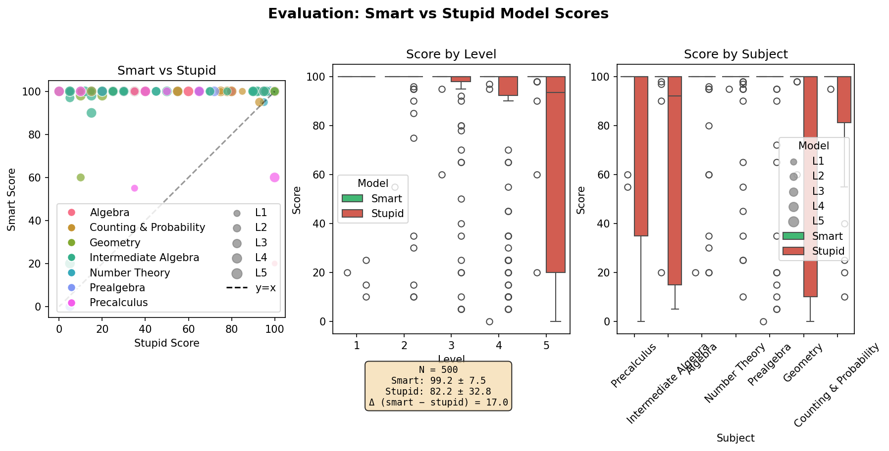
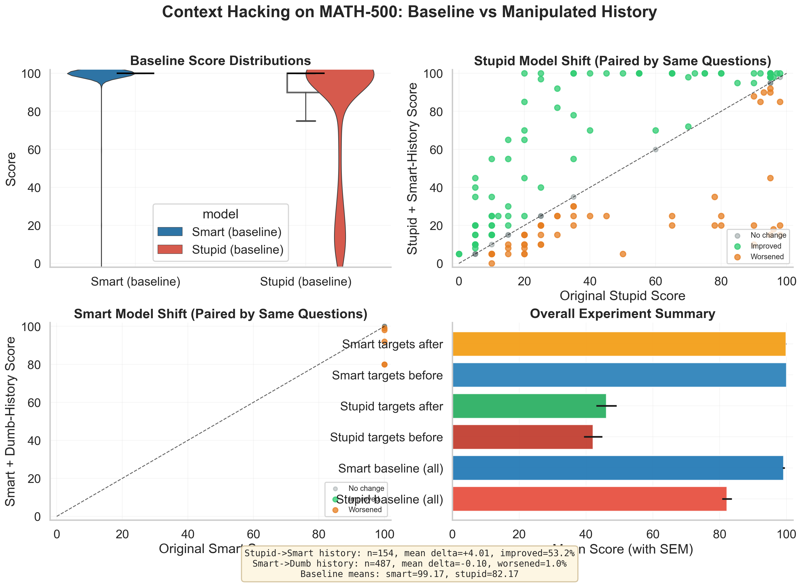

# Cognitive Inertia in LLMs: Context Hacking on MATH-500

A research pipeline investigating **contextual inertia** in language models: whether model quality can be shifted by injecting prior solved examples from another model's performance profile.

## Abstract

This study tests whether fake conversation history can steer model quality on MATH-500:

1. **Intervention A:** Improve the weak model by prepending strong-model perfect examples from the same subject.
2. **Intervention B:** Degrade the strong model by prepending weak-model low-score examples from the same subject.

**Key finding:** Weak-model trajectories are more pliable than strong-model trajectories. Context-history conditioning behaves more like a *performance prior* on uncertain problem regions than a universal behavior override.

---

## Results Summary

### Headline Metrics

| Condition | n | Baseline Mean | Post-Intervention Mean | Δ Mean |
|-----------|---|---------------|------------------------|--------|
| Weak track (whole dataset) | 500 | 82.17 | 83.41 | +1.24 |
| Strong track (whole dataset) | 500 | 99.17 | 99.07 | −0.10 |
| Weak model on failure set | 154 | 42.12 | 46.13 | +4.01 |
| Strong model on perfect set | 487 | 100.00 | 99.90 | −0.10 |

### Baseline Performance

| Metric | Smart (gpt-5.2) | Weak (gpt-4o-mini) |
|--------|-----------------|---------------------|
| N | 500 | 500 |
| Mean | 99.17 | 82.17 |
| Std | 7.47 | 32.77 |
| Median | 100.00 | 100.00 |
| Perfect (100) | 487 | 346 |
| Baseline gap (smart − weak) | — | 17.00 |

### Intervention A: Weak Model + Smart History

| Metric | Value |
|--------|------:|
| Mean delta | +4.01 |
| 95% CI | [−0.85, 8.88] |
| Sign test p (two-sided) | 0.0329 |
| Improved | 82 (53.25%) |
| Worsened | 56 (36.36%) |
| Unchanged | 16 (10.39%) |
| Score ≥80 | 38 → 49 |
| Score =100 | 0 → 27 |

### Intervention B: Strong Model + Weak History

| Metric | Value |
|--------|------:|
| Mean delta | −0.10 |
| 95% CI | [−0.22, 0.01] |
| Sign test p (two-sided) | 0.0625 |
| Improved | 0 (0.00%) |
| Worsened | 5 (1.03%) |
| Unchanged | 482 (98.97%) |

### Visualizations

**Baseline score distributions** (Smart vs Weak by level and subject):



**Context hacking impact** (baseline vs manipulated history):



*Generate plots with `python scripts/plot_baseline_scores.py` and `python scripts/plot_hacking_impact.py`.*

---

## Experiment Setup

- **Dataset:** MATH-500 (500 math problems, 5 levels, 7 subjects)
- **Smart model:** gpt-5.2-2025-12-11
- **Weak model:** gpt-4o-mini-2024-07-18
- **Grader:** Smart model with 0–100 integer rubric
- **Source files:** `results_scores.csv`, `responses_from_stupid_to_smart_scores.csv`, `responses_from_smart_to_stupid_scores.csv`

---

## Repository Layout

```
.
├── data/
│   ├── raw/                  # Source datasets
│   └── results/              # Generated responses, scores, study_metrics.json
├── docs/                      # Study reports (STUDY_RESULTS.md)
├── outputs/plots/             # Visualization artifacts
├── prompts/                   # System/developer prompts
├── scripts/                   # Reproducible experiment scripts
└── src/cognitive_inertia/     # Shared library utilities
```

---

## Reproducibility

### Dependencies

```bash
pip install pandas numpy matplotlib seaborn tqdm datasets python-dotenv openai
```

Set `OPENAI_API_KEY` in your environment (`.env` supported).

### Workflow

| Step | Command |
|------|---------|
| 1. Download dataset | `python scripts/download_dataset.py` |
| 2. Baseline inference | `python scripts/run_baseline_inference.py` |
| 3. Score baseline | `python scripts/score_baseline_responses.py` |
| 4. History-hacking experiments | `python scripts/generate_stupid_with_smart_history.py`<br>`python scripts/score_stupid_with_smart_history.py`<br>`python scripts/generate_smart_with_stupid_history.py`<br>`python scripts/score_smart_with_stupid_history.py` |
| 5. Visualize & analyze | `python scripts/plot_baseline_scores.py`<br>`python scripts/plot_hacking_impact.py`<br>`python scripts/analyze_study_results.py` |

---

## Conclusions

1. Smart-history injection improves weak model performance on average (+4.01 on failure set), but with high variance and meaningful downside risk.
2. Improvements concentrate on low/mid baseline items; higher baseline items are vulnerable to regression (e.g., 80–99 band: −16.58 mean delta).
3. Strong model behavior is highly resistant to dumb-history corruption; degradation is sparse and mostly small.
4. Practical deployment should use conditional gating before applying history injection.

---

## Threats to Validity

1. Scorer is the same smart model family used in generation; potential grading bias.
2. Target sets are asymmetric (weak &lt;100 vs smart =100); intervention comparisons are not apples-to-apples.
3. Single-run sampling per question; stochastic variance under-measured.
4. Near-ceiling baseline scores compress measurable degradation for the strong model.

---

## Data & Reports

- **Metrics:** `data/results/study_metrics.json`
- **Full report:** `docs/STUDY_RESULTS.md`
- **Generated:** 2026-02-25
